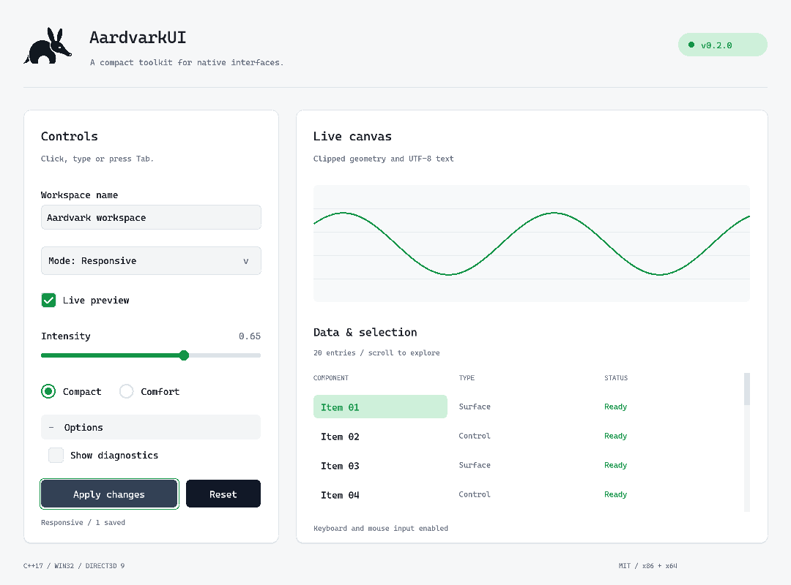

# AardvarkUI

C++17 immediate-mode UI for **Win32 and Direct3D 9, x86 and x64**. MIT licensed.

Text editing with selection, clipboard and undo; keyboard navigation; buttons, sliders, checkboxes, radio buttons, combo boxes, popups, scrollable panels and equal-width tables. Draw lists batch clipped geometry, images and UTF-8 text.



The demo uses Cascadia Code when installed, a light theme and an embedded Aardvarkland icon. Windows substitutes a font if needed. No external library dependencies.

Build with Visual Studio 2022 C++ tools, the Windows SDK and CMake 3.21 or newer:

```powershell
cmake -S . -B build -A x64
cmake --build build --config Release
ctest --test-dir build -C Release --output-on-failure
.\build\Release\aardvark_ui_demo.exe
```

Use `-A Win32` in a separate directory for x86.

Add it to another CMake project:

```cmake
add_subdirectory(AardvarkUI)
target_link_libraries(your_app PRIVATE AardvarkUI::AardvarkUI)
```

See [integration](docs/integration.md) for installed packages, input routing and lifecycle. Classic D3D9 only; no docking, multi-viewport, accessibility adapter or complex-script shaping.
